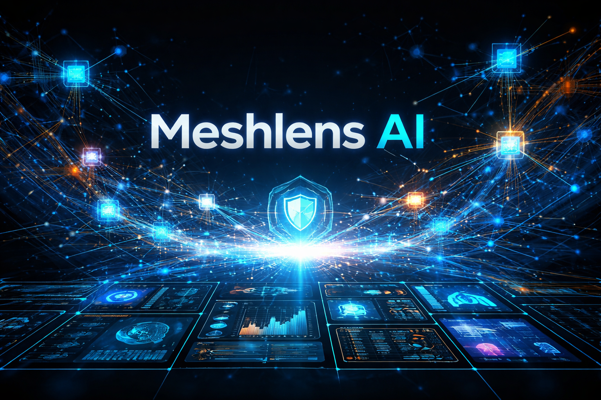
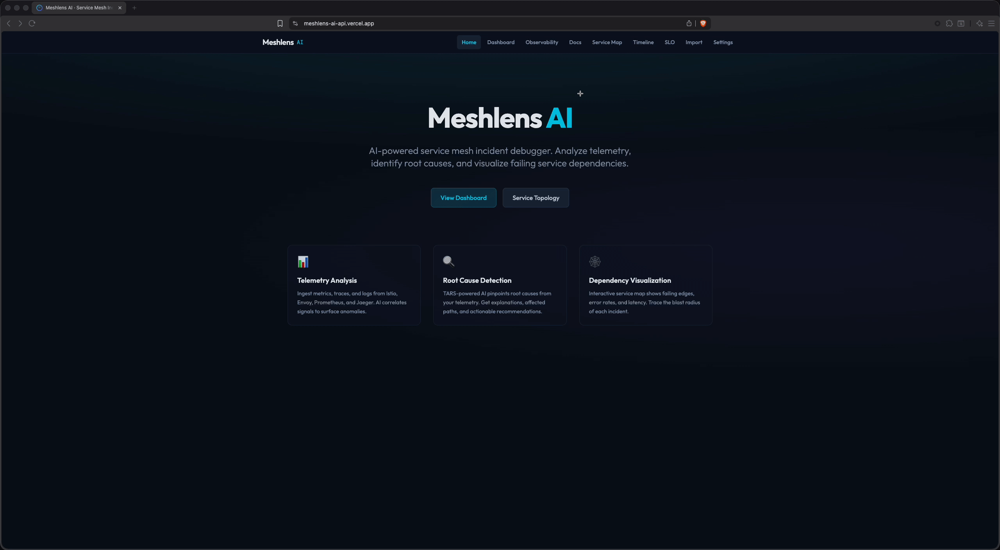

# 🌌 Meshlens AI

_AI-powered service mesh incident debugger_ 🦝



[](https://github.com/NickTheDevOpsGuy/meshlens-ai/actions/workflows/ci.yml)


---

## 🎯 Problem & Solution

**Problem:** When service mesh incidents happen, engineers spend hours correlating metrics, traces, and alerts to find root cause. Distributed failures cascade across services, making it hard to see the full picture.

**Solution:** Meshlens AI aggregates incidents from sample data, Prometheus, Jaeger, and Alertmanager—then uses **Tetrate Agent Router Service (TARS)** to analyze dependency graphs and suggest root causes. One dashboard, AI-powered analysis, PDF reports, and Slack/PagerDuty integration.

---

## 🔗 Live Demo

- [Try Meshlens AI](https://meshlens-ai-api.vercel.app)
- [Docs](https://meshlens-ai-api.vercel.app/docs)

---

## 🖼 Preview



---

## 🚀 Features

- **Dashboard** – Incident list with severity/status filters, search, and live telemetry
- **AI root cause analysis** – TARS-powered "Analyze with AI" on any incident
- **Incident correlation** – Group by service or by time (shared services, within 30 min)
- **Service topology** – Visualize failing dependencies (sample + live from Prometheus/Jaeger)
- **Incident timeline** – Overlapping incidents and duration
- **SLO/SLI view** – Service level objectives vs actuals (sample + live Prometheus)
- **PDF export** – Export incident reports with AI analysis, root cause, recommendations
- **Hot-reload samples** – API watches `samples/incidents/`; dashboard auto-refreshes on Import
- **Observability hub** – Central page for metrics (Prometheus), traces (Jaeger/Tempo), logs (Loki), dashboards (Grafana), and alerts (Alertmanager)
- **Alertmanager integration** – Firing alerts surfaced as incidents
- **Export / share** – Export JSON, copy shareable link, notify Slack/PagerDuty
- **Runbook links** – Associate runbooks with incidents
- **Trace drill-down** – Link to Jaeger trace from incident
- **Auto-refresh** – Configurable refresh for live telemetry
- **Import** – Paste or upload JSON; saves to samples (local only)

---

## 🏗 Architecture

```
┌─────────────────┐     ┌──────────────────────────────────────────────────┐
│   React + Vite  │     │                    Hono API                       │
│   (port 5173)   │────►│  /api/samples  /api/ai/analyze  /api/prometheus   │
│   Tailwind v4   │     │  /api/jaeger   /api/alertmanager  /api/notify      │
└─────────────────┘     └──────────────────────────────────────────────────┘
        │                                    │
        │                                    ├──► TARS (AI analysis)
        │                                    ├──► Prometheus (metrics/SLO)
        └── localStorage (settings)           ├──► Jaeger (traces)
                                             ├──► Alertmanager (alerts)
                                             └──► Slack / PagerDuty
```

---

## 🛠 Tech Stack

| Layer    | Tech                                              |
| -------- | ------------------------------------------------- |
| Frontend | React 19, Vite 6, Tailwind CSS v4, React Router 7 |
| Backend  | Hono (Node + Vercel serverless)                   |
| AI       | Tetrate Agent Router Service (TARS)               |
| Data     | TypeScript, pnpm monorepo, `@meshlens/shared`     |
| Deploy   | Vercel                                            |

---

## 📦 Getting Started

1. **Clone the repository**

   ```bash
   git clone https://github.com/NickTheDevOpsGuy/meshlens-ai.git
   cd meshlens-ai
   ```

2. **Configure environment (TARS)**

   ```bash
   cp .env.example .env
   ```

   Edit `.env` and add your **Tetrate Agent Router Service (TARS)** API key:
   - Sign up at [router.tetrate.ai](https://router.tetrate.ai/)
   - Get your API key from [API keys](https://router.tetrate.ai/api-keys)
   - Set `TETRATE_API_KEY` in `.env`

3. **Install dependencies**

   ```bash
   pnpm install
   ```

4. **Run the development server**

   ```bash
   pnpm dev
   ```

   This starts the web app (http://localhost:5173) and API (http://localhost:3001). Configure Prometheus and Jaeger URLs in Settings for live telemetry.

---

## 🚢 Deploy to Vercel

1. **Connect the repo** to [Vercel](https://vercel.com) (import from GitHub).
2. **Project Settings** → **General** → **Build & Development Settings**:
   - **Root Directory**: leave **empty** (repo root) — required for `/api/*` serverless functions
   - **Framework Preset**: Vite or React
   - **Include source files outside of the Root Directory**: enable (for monorepo)
   - Build: `pnpm --filter @meshlens/web build` · Output: `apps/web/dist` · Install: `pnpm install`
3. **Environment variables** (optional): `TETRATE_API_KEY`, `TARS_API_BASE_URL`, `TARS_MODEL`. If POST/body requests fail, add `NODEJS_HELPERS=0` (see [Hono on Vercel](https://hono.dev/getting-started/vercel)).

The API runs as serverless functions at `/api/*`. Sample incidents are read from the repo; **Import** is read-only on Vercel.

### Run with Docker

```bash
docker compose up --build
```

Then open http://localhost:3000. Set `TETRATE_API_KEY` in `.env` for AI analysis.

---

## 🧪 Try it yourself

1. Open the **Dashboard** — you’ll see sample incidents.
2. Click an incident to open its **Incident Detail** page.
3. Click **"Analyze with AI"** (requires `TETRATE_API_KEY` in `.env`).
4. Use **Export PDF** to download a report.
5. Visit **Observability** to see configured telemetry backends and quick links to Prometheus, Grafana, Jaeger, Loki, and Alertmanager.
6. Toggle **View** to "Group by service" or "Correlated" on the Dashboard.
7. Go to **Import** to paste or upload JSON (needs API running locally).

---

## 📁 Sample incident data

Add incident JSON files to `samples/incidents/` and list them in `manifest.json`. See `samples/incidents/README.md` for the schema.

## 🤖 AI root cause analysis

Click **"Analyze with AI"** on any incident. Add `TETRATE_API_KEY` to `.env` and restart the API. On Vercel, add the key in **Settings → Environment Variables** and redeploy. Verify with `curl https://your-deployment.vercel.app/api/health` — `tarsConfigured: true` means it's ready.

## 📡 Live telemetry & observability

When Prometheus, Jaeger, Grafana, Loki, or Alertmanager URLs are configured in **Settings**:

- **Observability** – Hub page shows configured backends and quick links to each tool
- **Dashboard** – Fetches live incidents (high error rates from Istio metrics)
- **Service Map** – Shows "Load live topology" for the live graph
- The API proxies requests to Prometheus, Jaeger, and Alertmanager to avoid CORS

Prometheus must scrape `istio_requests_total` (or similar). Jaeger's `/api/dependencies` provides the service graph. Loki (logs) and Grafana (dashboards) URLs enable linking from the Observability page.

---

## 📂 Project Structure

<details>
<summary>📁 Click to expand file structure</summary>

```
.
├── .github
│   ├── ISSUE_TEMPLATE
│   │   ├── bug_report.md
│   │   └── feature_request.md
│   ├── workflows
│   │   ├── ci.yml
│   │   ├── release.yml
│   │   └── vercel-production.yml
│   ├── dependabot.yml
│   └── PULL_REQUEST_TEMPLATE.md
├── .husky
│   ├── pre-commit
│   └── pre-push
├── api
│   ├── ai
│   │   └── analyze.js
│   ├── samples
│   │   ├── incidents.js
│   │   └── version.js
│   ├── [[...path]].js
│   └── health.js
├── apps
│   ├── api
│   │   ├── src
│   │   │   ├── app.test.ts
│   │   │   ├── app.ts
│   │   │   ├── index.ts
│   │   │   └── serve.ts
│   │   ├── package.json
│   │   ├── tsconfig.json
│   │   └── vitest.config.ts
│   └── web
│       ├── api
│       │   ├── ai
│       │   │   └── analyze.js
│       │   ├── samples
│       │   │   ├── incidents.js
│       │   │   └── version.js
│       │   ├── [[...path]].js
│       │   └── health.js
│       ├── public
│       │   ├── docs
│       │   │   ├── configuration.md
│       │   │   ├── deployment.md
│       │   │   ├── getting-started.md
│       │   │   ├── incidents.md
│       │   │   ├── overview.md
│       │   │   ├── prometheus-slo-recording-rules.md
│       │   │   └── runbooks.md
│       │   ├── samples
│       │   │   └── incidents
│       │   │       ├── config-rollback.json
│       │   │       ├── manifest.json
│       │   │       ├── memory-leak.json
│       │   │       └── network-partition.json
│       │   ├── favicon.svg
│       │   └── preview.png
│       ├── scripts
│       │   └── build-api.mjs
│       ├── src
│       │   ├── api
│       │   │   ├── ai
│       │   │   │   └── analyze.ts
│       │   │   ├── samples
│       │   │   │   ├── incidents.ts
│       │   │   │   └── version.ts
│       │   │   ├── _handler.ts
│       │   │   ├── [[...path]].ts
│       │   │   └── health.ts
│       │   ├── components
│       │   │   ├── ErrorBoundary.tsx
│       │   │   └── Layout.tsx
│       │   ├── data
│       │   │   ├── sampleIncidents.ts
│       │   │   └── sampleSLOs.ts
│       │   ├── hooks
│       │   │   ├── useIncidents.ts
│       │   │   └── useSettings.ts
│       │   ├── pages
│       │   │   ├── DashboardPage.tsx
│       │   │   ├── DocsPage.tsx
│       │   │   ├── HomePage.tsx
│       │   │   ├── ImportPage.tsx
│       │   │   ├── IncidentDetailPage.tsx
│       │   │   ├── ObservabilityPage.tsx
│       │   │   ├── RunbookPage.tsx
│       │   │   ├── ServiceMapPage.tsx
│       │   │   ├── SettingsPage.tsx
│       │   │   ├── SLOPage.tsx
│       │   │   └── TimelinePage.tsx
│       │   ├── services
│       │   │   ├── alerts.ts
│       │   │   ├── incidents.test.ts
│       │   │   ├── incidents.ts
│       │   │   └── telemetry.ts
│       │   ├── utils
│       │   │   ├── incidentUtils.test.ts
│       │   │   └── incidentUtils.ts
│       │   ├── App.tsx
│       │   ├── index.css
│       │   └── main.tsx
│       ├── eslint.config.js
│       ├── index.html
│       ├── package.json
│       ├── tsconfig.json
│       ├── tsconfig.node.json
│       ├── tsconfig.node.tsbuildinfo
│       ├── tsconfig.tsbuildinfo
│       ├── vercel.json
│       └── vite.config.ts
├── docs
│   ├── configuration.md
│   ├── deployment.md
│   ├── getting-started.md
│   ├── incidents.md
│   ├── prometheus-slo-recording-rules.md
│   ├── README.md
│   └── runbooks.md
├── packages
│   └── shared
│       ├── src
│       │   ├── incidentBundle.ts
│       │   └── index.ts
│       ├── package.json
│       └── tsconfig.json
├── public
│   └── assets
├── samples
│   ├── incidents
│   │   ├── config-rollback.json
│   │   ├── manifest.json
│   │   ├── memory-leak.json
│   │   ├── network-partition.json
│   │   └── README.md
│   └── prometheus
│       └── slo-recording-rules.yml
├── scripts
│   ├── check-bundle-size.sh
│   └── precheck.sh
├── .cursorrules
├── .dockerignore
├── .editorconfig
├── .env.example
├── .gitignore
├── .prettierignore
├── .prettierrc
├── AGENTS.md
├── CHANGELOG.md
├── CONTRIBUTING.md
├── docker-compose.yml
├── Dockerfile
├── LICENSE
├── package.json
├── pnpm-lock.yaml
├── pnpm-workspace.yaml
├── README.md
└── SECURITY.md
```

## </details>

## 🗓️ Roadmap

- [x] PDF export for incident reports
- [x] Incident correlation/grouping
- [x] Hot-reload samples
- [x] Prometheus SLO recording rules (see [docs/prometheus-slo-recording-rules.md](./docs/prometheus-slo-recording-rules.md))
- [x] Observability hub (metrics, traces, logs, dashboards, alerts)

---

## 🤝 Contributing

- 🐛 Report bugs in [Issues](https://github.com/NickTheDevOpsGuy/meshlens-ai/issues)
- 💡 Suggest features or improvements
- 🔧 Open a Pull Request

---

## 🦝 Built by NickDoesDevOps

Created with ☕, curiosity, and a touch of chaos by [Nicholas Clark](https://www.linkedin.com/in/nickdoesdevops).  
Follow the journey → [GitHub](https://github.com/NickTheDevOpsGuy) • [LinkedIn](https://www.linkedin.com/in/nickdoesdevops)

🏷 #NickDoesDevOps • #LearningInPublic • #BuiltInPublic
